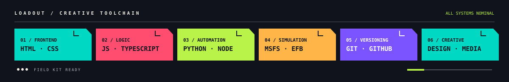

## About

**AstorAST** is an independent creator and developer operating within the AST Network, exploring the boundary between digital systems, simulation, media and fictional worlds. I build interactive experiences where interfaces behave like systems, data becomes part of the story, and every project can become another fragment of a larger world.

My visual direction pairs simplified forms with high-contrast color and interface-like motion. Each project is another signal from the AST Network: worlds, systems and stories connected through one creative practice.

## The AST Network

### ASTUniverse — World node active

An expanding network of worlds, characters, stories and forgotten fragments. New records continue to surface as the AST Universe grows beyond its original boundaries.

### AST//LOST SIGNAL — Signal unresolved

An unidentified transmission buried somewhere within the AST Network. Lost records, corrupted data and unknown entities point toward a layer that should not exist.

### ASTSIM — Simulation node online

A simulation branch focused on virtual aviation, aircraft systems, EFB interfaces and performance technologies. It reproduces complex systems inside another world.

### Interactive Systems — Network layer expanding

Experimental interfaces, websites and digital environments designed to behave less like pages and more like functioning systems connected to the network.

### Media Archive — Archive node active

Visual identities, motion systems, recordings and creative experiments preserved as fragments of the wider AST ecosystem.

## Technology

The toolchain spans web development, automation, flight simulation, version control, design and media production.

## GitHub Activity

Small, consistent contributions build toward larger releases. GitHub's profile contribution graph below shows the actual day-to-day activity.

## Philosophy

> **MADE THINGS FOR HUMAN, FOR AI, FOR EARTH**

`ASTUniverse` / `ASTSIM` / `SOFTWARE` / `MEDIA` / `SIMULATION`

**JUST MADE EVERYTHING.**

